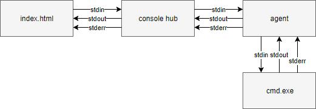
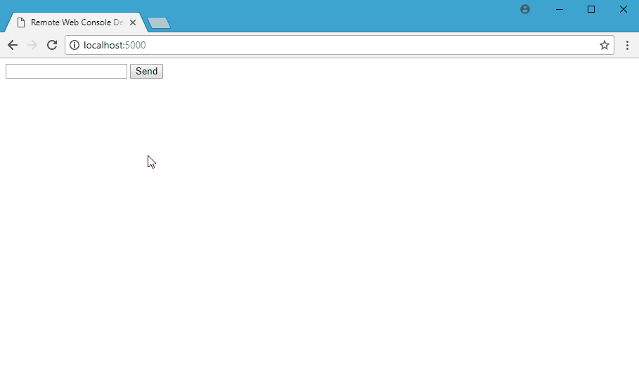

# Remote Web Console Demo

**Disclaimer:** This is a small showcase application. There's no
fancy styling, no error checking or anything else beyond the proof
of concept.

The purpose of this project is to demonstrate how a web application
could run remote processes on remote machines. It uses
[SignalR Core](https://github.com/aspnet/SignalR) to bring the
different pieces together:

* A web application hosting the SignalR hub. This hub has two 
functions:
  * receiving commands from the HTML page and forwarding them to
    the agent.
  * getting the ouput from the agent and forwarding them to the
    HTML page.

* An HTML page with an input field to enter the command, a submit
  button to send that command to the hub, and a `div` element where
  the result received from the hub will be added.

* A console application `WebConsoleDemo.Agent` running `cmd.exe`
  in the background. It
  * receives commands form the hub and
  * sends back the outout of the command back to the hub.

The point of this proof of concept is that SignalR can be used
to send commands to an agent and get back the results in realtime.

